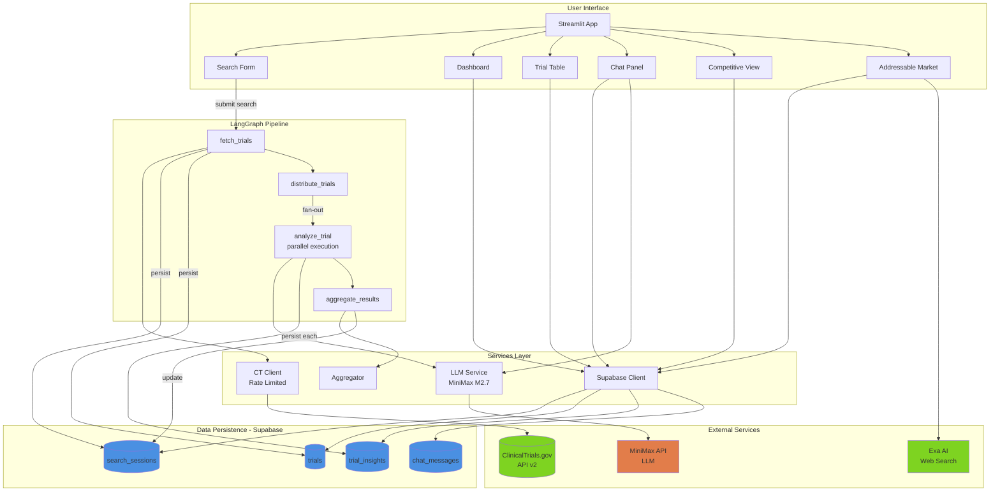
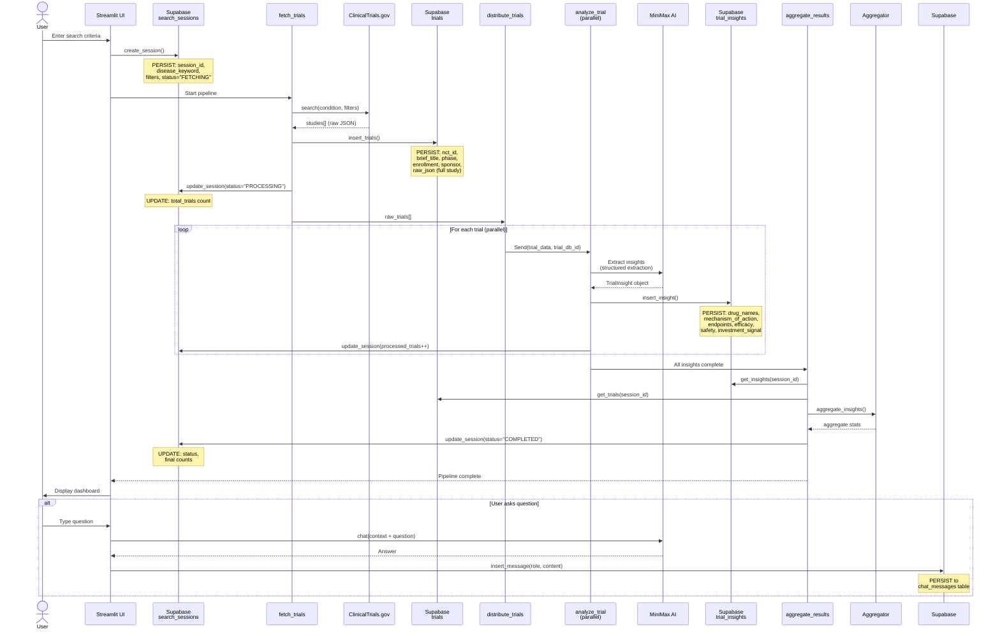
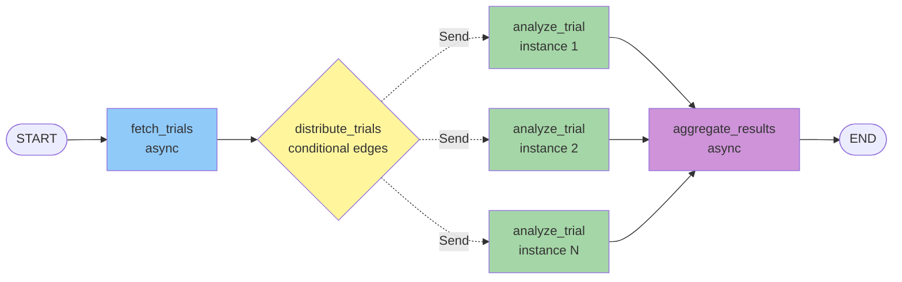

# System Architecture

## Overview

This application is a **Clinical Trials Investment Dashboard** that fetches clinical trial data from ClinicalTrials.gov, uses AI (MiniMax) to extract investment insights, and provides an interactive dashboard for analysis and Q&A.

**Tech Stack:**
- **Frontend:** Streamlit (Python-based web UI)
- **Orchestration:** LangGraph (agent workflow framework)
- **AI/LLM:** MiniMax-M2.7 (via LangChain ChatOpenAI)
- **Database:** Supabase (PostgreSQL)
- **External APIs:** ClinicalTrials.gov API v2, Exa AI (standalone search tool)

---

## High-Level Architecture



---

## Data Flow with Persistence Points

This diagram shows the complete pipeline from user search to final results, highlighting **where intermediate data is persisted** to Supabase.



---

## Database Schema (Supabase Tables)

### 1. `search_sessions`
Tracks each user search and pipeline execution.

```sql
- id (uuid, PK)
- disease_keyword (text) -- e.g., "NSCLC", "Alzheimer's"
- filters (jsonb) -- phase, status, date_range
- status (text) -- FETCHING | PROCESSING | COMPLETED | ERROR
- total_trials (int)
- processed_trials (int)
- created_at (timestamp)
- updated_at (timestamp)
```

**Persistence points:**
- Created when user submits search
- Updated when trials are fetched (total_trials)
- Updated as each trial is analyzed (processed_trials++)
- Updated when pipeline completes (status=COMPLETED)

---

### 2. `trials`
Raw clinical trial data from ClinicalTrials.gov.

```sql
- id (uuid, PK)
- session_id (uuid, FK -> search_sessions)
- nct_id (text) -- e.g., "NCT01234567"
- brief_title (text)
- phase (text) -- PHASE1, PHASE2, PHASE3, PHASE4, NA
- overall_status (text) -- RECRUITING, COMPLETED, etc.
- enrollment_count (int)
- enrollment_type (text)
- sponsor_name (text)
- sponsor_class (text) -- INDUSTRY, NIH, OTHER
- has_results (boolean)
- start_date (date)
- completion_date (date)
- conditions (text[]) -- array of condition names
- raw_json (jsonb) -- full study object from CT.gov
- created_at (timestamp)
```

**Persistence point:**
- Inserted in bulk after `fetch_trials` retrieves data from ClinicalTrials.gov
- Includes complete raw JSON for future analysis

---

### 3. `trial_insights`
AI-extracted investment insights from MiniMax analysis.

```sql
- id (uuid, PK)
- session_id (uuid, FK -> search_sessions)
- trial_id (uuid, FK -> trials)
- drug_names (text[])
- drug_types (text[]) -- DRUG, BIOLOGICAL, DEVICE, etc.
- mechanism_of_action (text)
- primary_endpoints (jsonb[]) -- [{measure, time_frame, result}, ...]
- secondary_endpoints (jsonb[])
- efficacy_summary (text)
- safety_summary (text)
- serious_ae_count (int)
- other_ae_count (int)
- top_adverse_events (jsonb[]) -- [{term, count, severity}, ...]
- investment_signal (text) -- POSITIVE | NEUTRAL | NEGATIVE | INSUFFICIENT_DATA
- investment_rationale (text)
- competitive_notes (text)
- created_at (timestamp)
```

**Persistence point:**
- Inserted after each `analyze_trial` node completes
- One insight per trial
- Structured extraction via MiniMax function calling

---

### 4. `chat_messages`
Conversation history for investment Q&A.

```sql
- id (uuid, PK)
- session_id (uuid, FK -> search_sessions)
- role (text) -- "user" | "assistant"
- content (text)
- created_at (timestamp)
```

**Persistence point:**
- User message inserted when chat query submitted
- Assistant message inserted after MiniMax chat response
- Full conversation history maintained for context

---

## LangGraph Pipeline Details

The pipeline is a stateful directed graph built with LangGraph:



### Node Descriptions

1. **fetch_trials** (async)
   - Queries ClinicalTrials.gov with user filters
   - Parses and persists trials to `trials` table
   - Returns `raw_trials[]` array for distribution
   - **Persistence:** `search_sessions` (created + updated), `trials` (bulk insert)

2. **distribute_trials** (fan-out)
   - Creates a `Send` event for each trial
   - Enables parallel processing of trials
   - No persistence

3. **analyze_trial** (async, parallel)
   - Calls MiniMax with structured extraction prompt
   - Uses LangChain `bind_tools()` for function calling
   - Extracts `TrialInsight` schema from raw trial JSON
   - **Persistence:** `trial_insights` (one per trial), `search_sessions` (processed_trials++)

4. **aggregate_results** (async)
   - Fetches all trials + insights for session
   - Computes aggregate statistics (counts, distributions, top drugs/sponsors)
   - Marks session as complete
   - **Persistence:** `search_sessions` (status=COMPLETED)

---

## AI Integration Points

### 1. MiniMax for Trial Analysis
**Location:** `graph/pipeline.py:79-157` (analyze_trial)

**Purpose:** Extract structured investment insights from raw clinical trial data

**Input:** Raw trial JSON from ClinicalTrials.gov
**Output:** `TrialInsight` Pydantic object with:
- Drug names, types, mechanism of action
- Endpoints (primary/secondary)
- Efficacy and safety summaries
- Adverse events
- Investment signal (POSITIVE/NEUTRAL/NEGATIVE/INSUFFICIENT_DATA)
- Investment rationale

**Prompt:** `prompts/extraction.py:83-97` (EXTRACTION_SYSTEM_PROMPT)

**Model:** MiniMax-M2.7 via OpenAI-compatible API
**Temperature:** 0 (deterministic)

---

### 2. MiniMax for Investment Q&A
**Location:** `graph/chat.py:14-52` (chat function)

**Purpose:** Answer user questions about analyzed trials

**Input:** User question + context (aggregate stats, trial index, insights)
**Output:** Natural language answer

**Prompt:** `prompts/chat_system.py:49-76` (build_chat_system_prompt)

**Model:** MiniMax-M2.7
**Temperature:** 0.3 (slightly creative)

**Context provided:**
- Aggregate statistics (counts, distributions, signals)
- Trial index table (NCT ID, drugs, phase, status, signal)
- Detailed high-priority trial info (Phase 3+, Industry, Has Results, Positive)

**Persistence:** Chat messages saved to `chat_messages` table

---

### 3. Exa AI for Market Intelligence
**Locations:**
- Service wrapper: `services/exa_client.py`
- UI component: `components/addressable_market.py`
- Standalone CLI: `exa-client/main.py`

**Purpose:** Search the web for market research, patient population data, competitive intelligence

**Features:**
- **Market Data Search** (`search_market_data`): Returns titles, URLs, scores, publication dates
- **Content Retrieval** (`search_with_contents`): Returns full text content (max 2000 chars)
- **Autoprompt**: Exa's AI-powered query enhancement for better results

**UI Integration:**
- Suggested search templates: market size, patient population, competitive analysis, unmet needs
- Custom query input
- Result display with summaries
- Trial-based market context (sponsors, drugs, signals)
- Market opportunity insights

**Standalone CLI Usage:** `python exa-client/main.py "query" --num-results 10`

**Output:** Saved to `exa-client/SAVED/exa_{query}.json`

---

## UI Components

The Streamlit app (`app.py`) provides multiple views:

1. **Search Form** (`components/search_form.py`)
   - Input: disease keyword, filters (phase, status, date range)
   - Triggers: Pipeline execution

2. **Dashboard** (`components/dashboard.py`)
   - Displays: Aggregate statistics, phase distribution, investment signals
   - Data source: `aggregate` object, `trials`, `insights`

3. **Competitive Dynamics** (`components/competitive.py`)
   - Displays: Competitive landscape analysis
   - Data source: `trials`, `insights`

4. **Trial Table** (`components/trial_table.py`)
   - Displays: Sortable/filterable table of all trials with insights
   - Data source: `trials`, `insights`

5. **Chat Panel** (`components/chat_panel.py`)
   - Displays: Q&A interface with conversation history
   - Data source: `chat_messages`, calls `graph/chat.py`

6. **Addressable Market** (`components/addressable_market.py`)
   - Displays: Market intelligence search powered by Exa AI
   - Features: Suggested market queries, custom search, trial-based market context
   - Data source: Exa AI web search, `trials`, `aggregate`

---

## External Service Integrations

### ClinicalTrials.gov API v2
**Client:** `services/ct_client.py`

**Features:**
- Rate limiting (1.2s between requests, ~50/min)
- Pagination support
- Advanced filtering (phase, status, date range)
- Uses `requests` library (httpx blocked by CT.gov TLS fingerprinting)

**Endpoints:**
- `GET /api/v2/studies` - Search studies
- `GET /api/v2/studies/{nct_id}` - Get specific study

---

### MiniMax API
**Client:** `services/llm.py`

**Configuration:**
- Base URL: `https://api.minimax.io/v1`
- Model: `MiniMax-M2.7`
- Interface: OpenAI-compatible (via LangChain `ChatOpenAI`)

**Usage:**
- Trial analysis (temperature=0)
- Chat Q&A (temperature=0.3)
- Function calling for structured extraction

---

### Exa AI API
**Client:** `exa-client/main.py`

**Configuration:**
- Uses `exa_py` Python library
- Requires `EXA_API_KEY` environment variable

**Usage:**
- Standalone CLI tool for web search
- Saves results to JSON files
- Not yet integrated into main pipeline

---

## Deployment Considerations

### Environment Variables
```bash
MINIMAX_API_KEY=your_minimax_key
SUPABASE_URL=your_supabase_url
SUPABASE_KEY=your_supabase_anon_key
EXA_API_KEY=your_exa_key  # optional, for standalone search
```

### Database Setup
Requires Supabase project with tables:
- `search_sessions`
- `trials`
- `trial_insights`
- `chat_messages`

(Schema definitions in Supabase SQL editor)

### Running the App
```bash
uv sync  # Install dependencies
uv run streamlit run app.py
```

---

## Data Persistence Summary

| **Stage** | **Action** | **Table(s)** | **Data Stored** |
|-----------|-----------|--------------|-----------------|
| User submits search | Create session | `search_sessions` | disease_keyword, filters, status=FETCHING |
| fetch_trials completes | Bulk insert | `trials` | nct_id, title, phase, sponsor, raw_json |
| fetch_trials completes | Update session | `search_sessions` | total_trials, status=PROCESSING |
| Each analyze_trial completes | Insert insight | `trial_insights` | drug_names, endpoints, efficacy, safety, signal |
| Each analyze_trial completes | Update session | `search_sessions` | processed_trials++ |
| aggregate_results completes | Update session | `search_sessions` | status=COMPLETED |
| User sends chat message | Insert messages | `chat_messages` | role=user, content |
| MiniMax responds | Insert message | `chat_messages` | role=assistant, content |

**Key insight:** Data is persisted incrementally throughout the pipeline, allowing for:
- Progress tracking (processed_trials vs total_trials)
- Crash recovery (can resume from last persisted state)
- Historical analysis (all raw data and insights retained)
- Conversation continuity (full chat history maintained)
